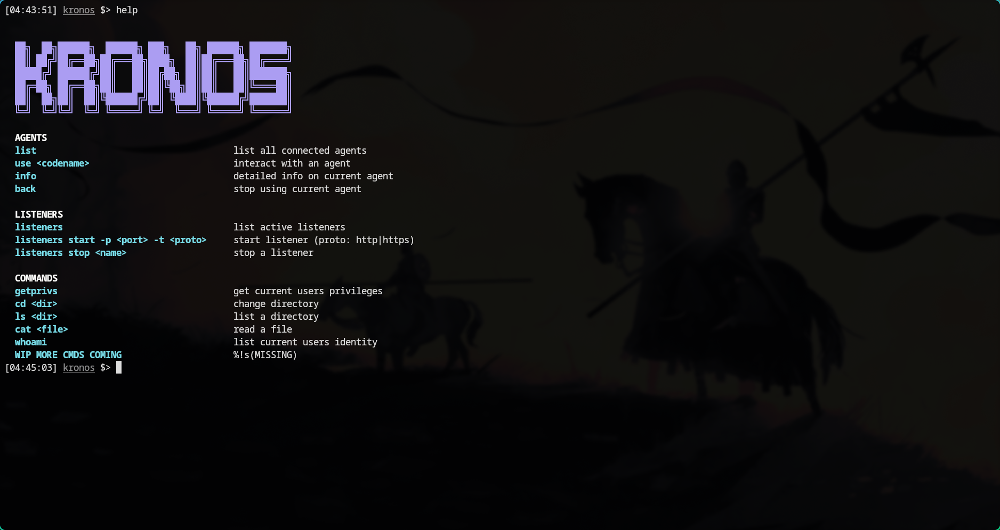

# Kronos C2

> **Work in Progress** — not ready for production use.

Kronos is a command-and-control framework written in Go. It consists of a teamserver, an operator CLI client, and a Windows agent.

## Components

- **server** — teamserver exposing a REST API and SSE event stream for operators, with SQLite-backed agent and task tracking
- **client** — operator CLI for managing agents, listeners, and tasking
- **agent** — Windows implant (WIP)

## Features

- JWT-authenticated operator sessions
- HTTP/HTTPS listeners with named identifiers
- Agent registration and check-in
- Real-time event streaming to connected operators
- SQLite persistence for agents, tasks, and listeners

## Status

This project is under active development. Many features are incomplete or subject to change.
